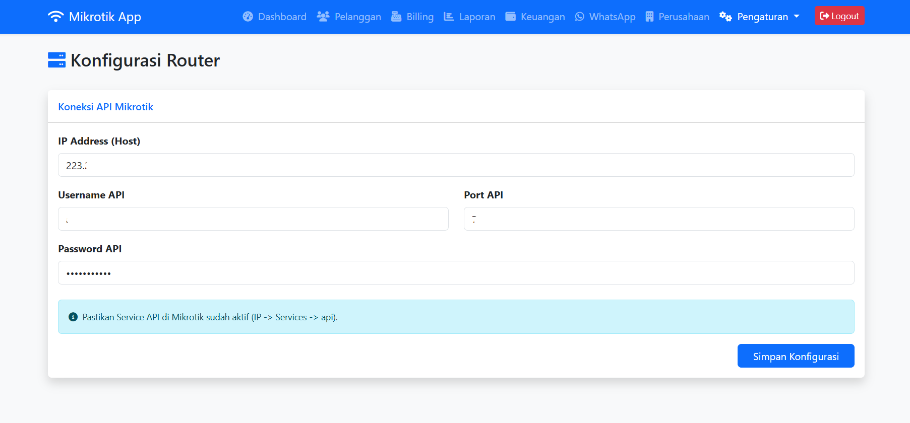
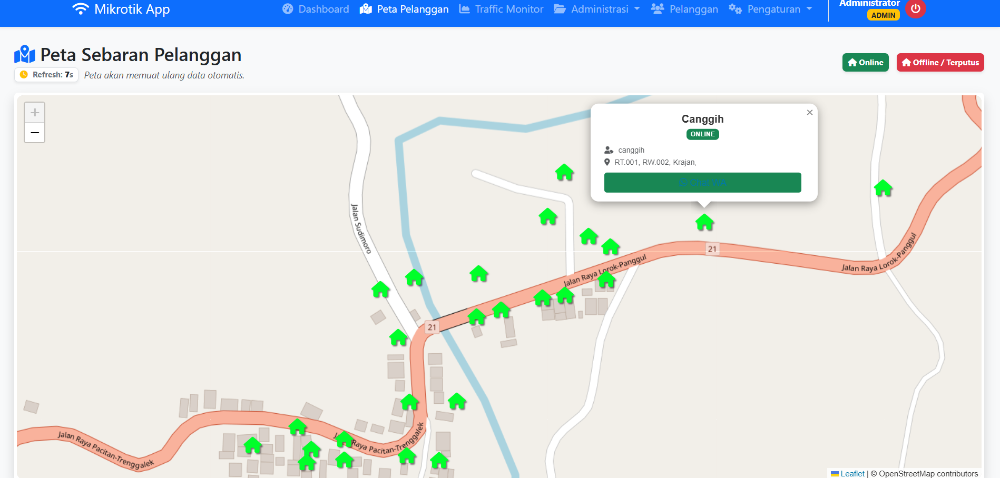
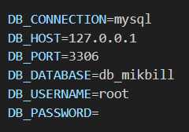

# MIKBILL - Mikrotik Billing & PPPoE Management System

**MIKBILL** adalah aplikasi manajemen ISP berbasis web yang dibangun dengan **Laravel**. Aplikasi ini dirancang untuk memudahkan pengelolaan pelanggan PPPoE, monitoring koneksi, penagihan (billing) otomatis, akuntansi sederhana, hingga notifikasi WhatsApp.

Aplikasi ini mendukung **Multi-Role** (Admin & Operator) dengan sistem *Data Scoping*, serta fitur **Frontend Publik** untuk pengecekan tagihan mandiri oleh pelanggan.

---

## 📸 Screenshots

### 1. Frontend Pelanggan (Cek Tagihan)
Halaman publik dimana pelanggan dapat memeriksa status tagihan dan mengunduh invoice tanpa perlu login.


### 2. Login Page
Halaman autentikasi untuk Admin dan Operator.


### 3. Dashboard Monitoring (Admin)
Monitoring realtime user online/offline, status router, dan statistik jaringan.


### 4. Billing & Penagihan
Manajemen invoice, status lunas/belum lunas, tombol bayar/batal, dan integrasi WhatsApp Gateway.


### 5. Whatsapp Gateway
Manajemen WhatsApp Gateway dan Pengiriman Pesan Kepada Pelanggan.


### 6. Laporan Pendapatan dan Cetak Invoice
Manajemen Laporan Pendapatan dan Cetak Tagihan Pelanggan.


### 7. Akuntansi
Manajemen Aknuntansi, mencatat Pendapatan dan Pengeluaran.


### 8. Koneksi Mikrotik
Halaman untuk mengonfigurasi API mikrotik untuk tujuan Monitoring user PPPoE.


### 9. Peta Pelanggan
Menampilkan Peta Pelanggan dengan memasukkan latitude dan longitude pelanggan pada aplikasi, maka akan tampil lokasi
Pelanggan, jika pelanggan tersambung maka warna logo rumah menjadi hijau, jika diskonek maka akan berwarna merah


---

## 🚀 Fitur Unggulan

### 📡 Monitoring & Mikrotik
- **Real-time Monitoring:** Status user Online/Offline langsung dari Router.
- **Sync Database:** Sinkronisasi 2 arah (Ambil user dari Mikrotik / Kirim user ke Mikrotik).
- **Auto ID:** Generate Nomor Internet (8 digit) otomatis.
- **Remote Action:** Kick user & Disable secret langsung dari web.
- **Dynamic Config:** Pengaturan koneksi Router disimpan di database (bisa ganti router tanpa edit koding).

### 📡 Peta Pelanggan
- **Real-time Maps:** Status user Online / Offline berdasarkan Maps (Lokasi Pelanggan)

### 💰 Billing & Finance
- **Auto Invoice:** Generate tagihan massal setiap bulan.
- **Manual Invoice:** Tagihan susulan untuk pelanggan baru.
- **Sistem Isolir:** - Jika jatuh tempo & belum bayar -> Otomatis Disable & Kick (Cron Job).
  - Jika klik "Bayar" -> Otomatis Enable & Kirim WA Lunas.
  - Jika klik "Batal" -> Otomatis Disable kembali & Kirim WA Batal.
- **Akuntansi (Laba Rugi):** Laporan Omset vs Pengeluaran Operasional secara otomatis.
- **Cetak Laporan:** Laporan keuangan PDF dengan opsi Rincian atau Rekapitulasi.

### 🔔 Notifikasi & Integrasi
- **WhatsApp Gateway:** Kirim tagihan, bukti bayar, dan broadcast info massal.
- **Cetak Invoice A4:** Invoice profesional dengan Logo Perusahaan, Tanda Tangan, dan Stempel Status.

### 👥 Manajemen User
- **Multi-Role:**
  - **Admin:** Akses Penuh.
  - **Operator:** Hanya akses Billing & Laporan (Hanya data pelanggan miliknya).
- **Data Scoping:** Admin dapat menunjuk Operator penanggung jawab untuk setiap pelanggan.

---

## 🛠️ Teknologi

- **Backend:** Laravel Framework (PHP 8.x)
- **Frontend:** Bootstrap 5, DataTables, jQuery
- **Database:** MySQL
- **Mikrotik API:** `evilfreelancer/routeros-api-php`

---

## 📥 Instalasi

### 1. Clone & Install
```bash
git clone [https://github.com/username/mikbill.git](https://github.com/aangwie/mikbill.git)
cd mikbill
```
### 2. Buat Database Pada PHPMyAdmin
- **Buat Database:** Buat database baru bernama `db_mikbill` pada phpmyadmin
- **Import SQL:** Import database `db_mikbill.sql` dari folder `dbschema`

### 3. Konfigurasi Database
- **Setting .env:** Buka `edit.env` pada root folder kemudian copy menjadi `.env` dengan perintah `cp edit.env .env` lalu konfigurasi seperti pada gambar dan sesuaikan nama database, user database, password, serta hostnya sesuai yang anda buat sebelumnya.



### 4. Jalankan Composer
- **Jalankan Composer:** Jalankan Composer dengan perintah `composer install` dan tunggu hingga proses selesai.

### 4. Jalankan Aplikasi
- **Jalankan Aplikasi Mikbill:** Buka cmd lalu ketik `php artisan serve`, akan terlihat host bisa di akses melalui port 8000 Misal `http://127.0.0.1:8000` atau `http://localhost:8000`

---

## ⏰ Cron Job (Shared Hosting)

Untuk menjalankan fitur otomatis (Isolir otomatis, Cleanup, dan **WhatsApp Terjadwal**), Anda perlu menambahkan Cron Job pada cPanel/Panel Hosting Anda:

### 1. Laravel Scheduler (Direkomendasikan)
Setup cron job setiap menit untuk menjalankan semua fitur terjadwal sekaligus:
```bash
* * * * * /usr/local/bin/php /home/username/public_html/artisan schedule:run >> /dev/null 2>&1
```
*(Sesuaikan `/usr/local/bin/php` dengan path PHP di hosting Anda dan `/home/username/public_html` dengan direktori root aplikasi).*

### 2. Manual WhatsApp Process (Optional)
Jika Anda hanya ingin menjalankan pemrosesan pesan WhatsApp secara manual/terpisah:
```bash
* * * * * /usr/local/bin/php /home/username/public_html/artisan whatsapp:process-scheduled >> /dev/null 2>&1
```

---

Developed By : **Aang Wie**
