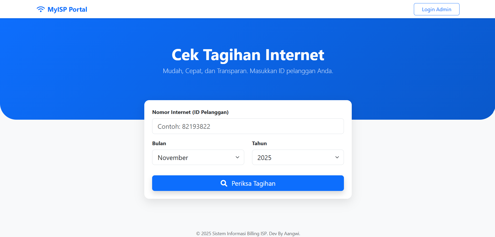
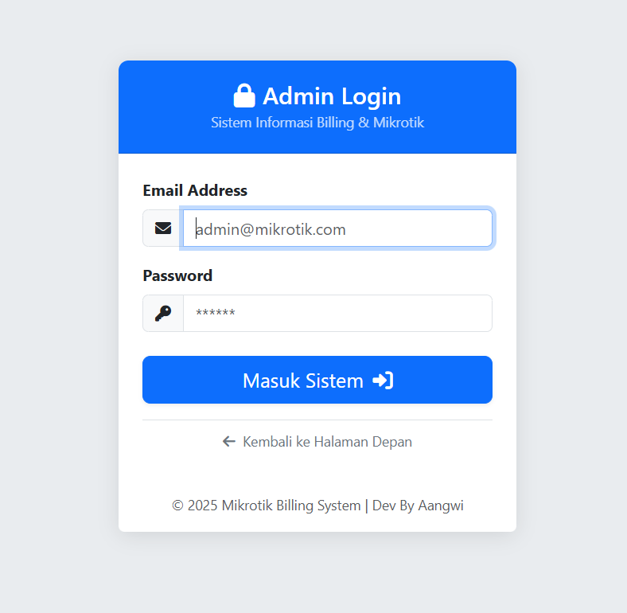
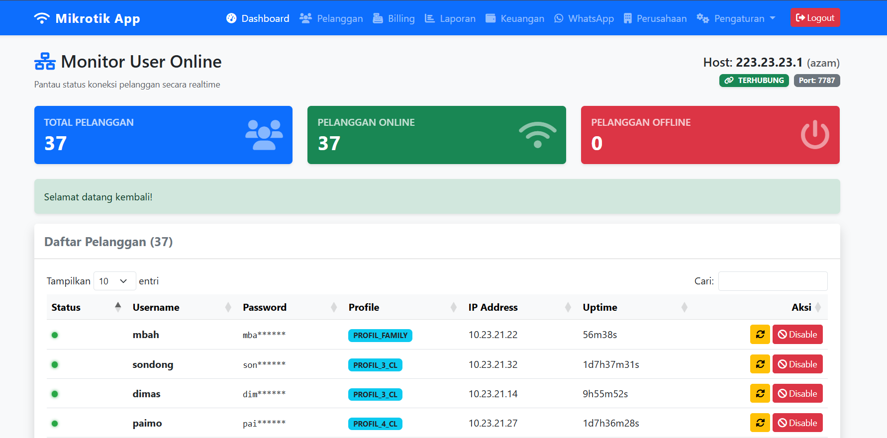
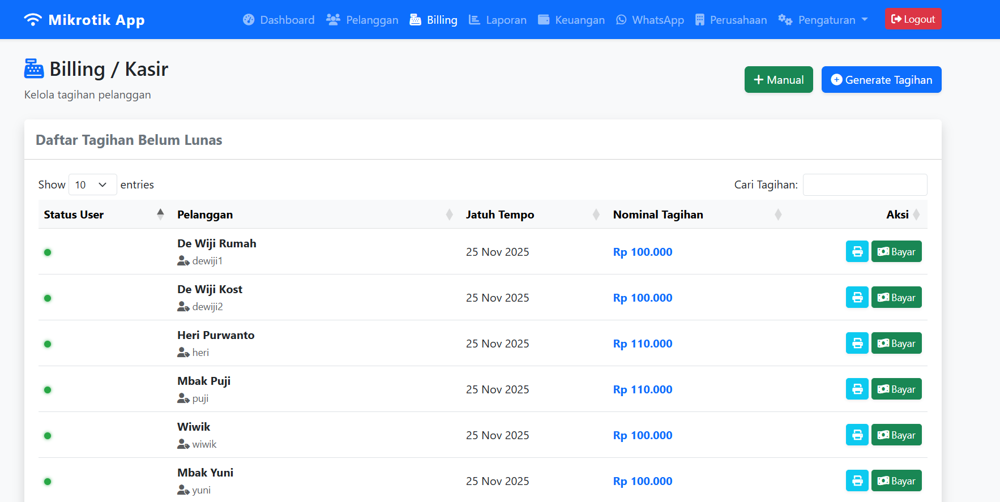
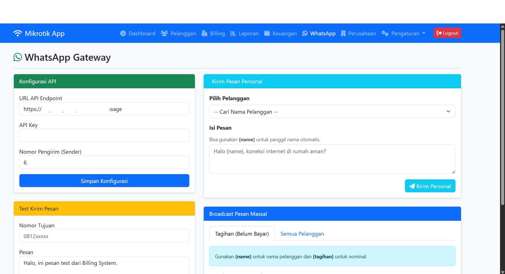
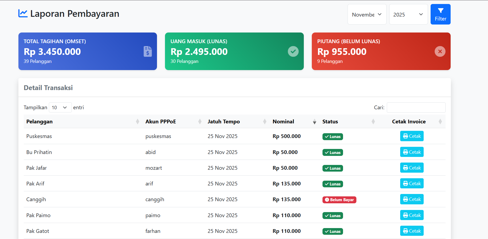

# MIKBILL - Mikrotik Billing & PPPoE Management System

**MIKBILL** adalah aplikasi manajemen ISP berbasis web yang dibangun dengan **Laravel**. Aplikasi ini dirancang untuk memudahkan pengelolaan pelanggan PPPoE, monitoring koneksi, penagihan (billing) otomatis, akuntansi sederhana, hingga notifikasi WhatsApp.

Aplikasi ini mendukung **Multi-Role** (Admin & Operator) dengan sistem *Data Scoping*, serta fitur **Frontend Publik** untuk pengecekan tagihan mandiri oleh pelanggan.

---

## 📸 Screenshots

### 1. Frontend Pelanggan (Cek Tagihan)
Halaman publik dimana pelanggan dapat memeriksa status tagihan dan mengunduh invoice tanpa perlu login.


### 2. Login Page
Halaman autentikasi untuk Admin dan Operator.


### 3. Dashboard Monitoring (Admin)
Monitoring realtime user online/offline, status router, dan statistik jaringan.


### 4. Billing & Penagihan
Manajemen invoice, status lunas/belum lunas, tombol bayar/batal, dan integrasi WhatsApp Gateway.


### 5. Whatsapp Gateway
Manajemen WhatsApp Gateway dan Pengiriman Pesan Kepada Pelanggan.


### 6. Laporan Pendapatan dan Cetak Invoice
Manajemen Laporan Pendapatan dan Cetak Tagihan Pelanggan.


### 7. Akuntansi
Manajemen Aknuntansi, mencatat Pendapatan dan Pengeluaran.

---

## 🚀 Fitur Unggulan

### 📡 Monitoring & Mikrotik
- **Real-time Monitoring:** Status user Online/Offline langsung dari Router.
- **Sync Database:** Sinkronisasi 2 arah (Ambil user dari Mikrotik / Kirim user ke Mikrotik).
- **Auto ID:** Generate Nomor Internet (8 digit) otomatis.
- **Remote Action:** Kick user & Disable secret langsung dari web.
- **Dynamic Config:** Pengaturan koneksi Router disimpan di database (bisa ganti router tanpa edit koding).

### 💰 Billing & Finance
- **Auto Invoice:** Generate tagihan massal setiap bulan.
- **Manual Invoice:** Tagihan susulan untuk pelanggan baru.
- **Sistem Isolir:** - Jika jatuh tempo & belum bayar -> Otomatis Disable & Kick (Cron Job).
  - Jika klik "Bayar" -> Otomatis Enable & Kirim WA Lunas.
  - Jika klik "Batal" -> Otomatis Disable kembali & Kirim WA Batal.
- **Akuntansi (Laba Rugi):** Laporan Omset vs Pengeluaran Operasional secara otomatis.
- **Cetak Laporan:** Laporan keuangan PDF dengan opsi Rincian atau Rekapitulasi.

### 🔔 Notifikasi & Integrasi
- **WhatsApp Gateway:** Kirim tagihan, bukti bayar, dan broadcast info massal.
- **Cetak Invoice A4:** Invoice profesional dengan Logo Perusahaan, Tanda Tangan, dan Stempel Status.

### 👥 Manajemen User
- **Multi-Role:**
  - **Admin:** Akses Penuh.
  - **Operator:** Hanya akses Billing & Laporan (Hanya data pelanggan miliknya).
- **Data Scoping:** Admin dapat menunjuk Operator penanggung jawab untuk setiap pelanggan.

---

## 🛠️ Teknologi

- **Backend:** Laravel Framework (PHP 8.x)
- **Frontend:** Bootstrap 5, DataTables, jQuery
- **Database:** MySQL
- **Mikrotik API:** `evilfreelancer/routeros-api-php`

---

## 📥 Instalasi

### 1. Clone & Install
```bash
git clone [https://github.com/username/mikbill.git](https://github.com/username/mikbill.git)
cd mikbill
composer install